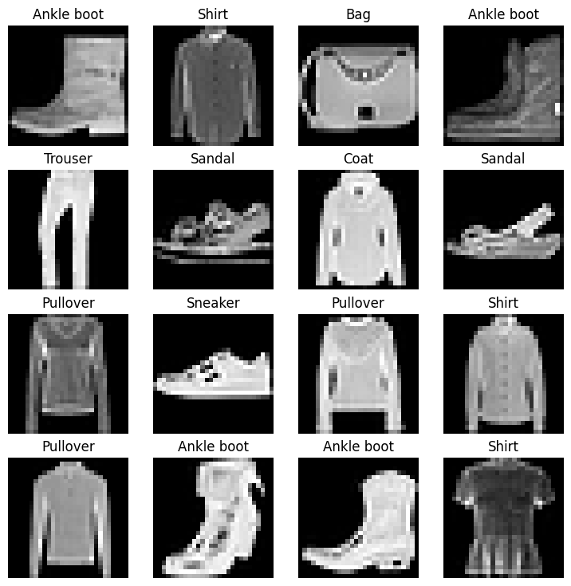

# GPU-Accelerated-Fashion-Classification-with-Non-Linear-Models
This repository contains a deep learning project that utilizes the FashionMNIST dataset to classify fashion items through non-linear function models, leveraging PyTorch. The project is designed to run on GPU to enhance computational efficiency and speed.The project is designed to run on GPU to enhance computational efficiency and speed. It demonstrates the implementation of various non-linear functions within neural networks to optimize classification accuracy.

- Model Architecture: Details about the non-linear models used, including activation functions.
- Performance Metrics: Accuracy, loss, and other relevant metrics detailed with visualizations.
- GPU Utilization: Explanation of GPU optimizations and configurations for PyTorch.
- Code and Usage: Instructions on how to run and modify the code.
